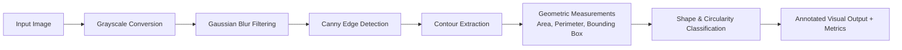

# Vision Inspector

<p align="center">
  
  
  
  
</p>

A classical computer-vision image inspection pipeline built with OpenCV. Inspects images, isolates structural boundaries, extracts contours, calculates geometric dimensions, and classifies shapes deterministically.

---

## 🔬 Inspection Pipeline



---

## ⚡ Core Capabilities

- **Noise Reduction**: Gaussian blur preprocessing to eliminate high-frequency noise prior to gradient computation.
- **Canny Edge Detection**: Dual-threshold hysteresis for structural boundary extraction.
- **Contour Analysis**:
  - Surface Area ($A$) and Perimeter ($P$) computation.
  - Bounding rectangle and minimum-area bounding box calculation.
- **Deterministic Shape Classification**:
  Calculates metric circularity ($C$):
  $$C = \frac{4 \pi \cdot \text{Area}}{\text{Perimeter}^2}$$
  - $C > 0.82 \implies$ `circle-like`
  - $0.55 < C \le 0.82 \implies$ `rounded / irregular`
  - $C \le 0.55 \implies$ `angular / polygonal`
- **Visual Annotation**: Renders labeled bounding boxes and shape classifications onto the target image.

---

## 🚀 Getting Started

### 1. Installation

```bash
git clone https://github.com/amwanshul/vision-inspector.git
cd vision-inspector

python -m venv venv
# Windows:
.\venv\Scripts\activate
# Linux/macOS:
source venv/bin/activate

pip install -r requirements.txt
```

### 2. Run Inspection

Inspect an image and generate annotated visual artifacts:

```bash
python inspect.py --input sample.jpg --output results/annotated_sample.jpg
```

---

## 🛠️ CLI Arguments

| Argument | Type | Default | Description |
|---|---|---|---|
| `--input` | string | *required* | Path to the source image file |
| `--output` | string | `None` | Path to save annotated output image |
| `--min-area` | float | `50.0` | Minimum contour area threshold to filter background noise |

---

## 📜 License

MIT License.
